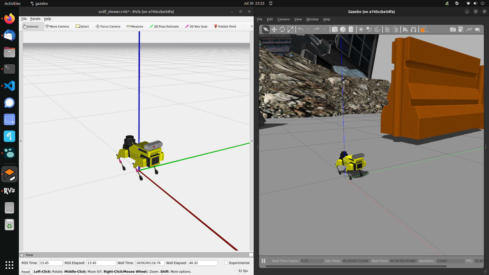

# mp_host_setup

Host computer Docker setup for interfacing with a Mini Pupper over a network or just running simulations locally.

We provide two versions of the Docker container:

- `develop`: Provides a development environment for users who want to work with the mini pupper robot.
- `deploy`: A tool meant to run the Mini Pupper robot from a host computer.

## Setup

First, install Docker from either the command line or from the Docker website.

```bash
~$ sudo apt install docker
```

Nvidia card owners may want to install `nvidia-docker` to help with performance of visualization and simulation tools such as RViz and Gazebo.

```bash
~$ sudo apt install nvidia-docker
```

Next, clone the repository into a desired folder and then change directory (`cd`) to it.

```bash
~$ git clone --recurse-submodules https://github.com/zmk5/mp_host_setup.git
~$ cd mp_host
```

Finally, we install the `rocker` submodule located within this repository:

```bash
~$ cd rocker
~$ python3 -m pip install -e .
```

## Building the Docker Images

Once `rocker` is installed, you may `cd` into either the `develop` or `deploy` directories and build the image directly. We suggest using `mp:develop` and `mp:deploy` as tag names for the `develop` and `deploy` directories, respectively.

**`develop`**

```bash
~$ cd develop
~$ docker build -t mp:develop .
```

**`deploy`**

```bash
~$ cd deploy
~$ docker build -t mp:deploy .
```

If you know the `ROS_MASTER_URI` and `ROS_IP` for the host computer, you can add them as parameters to the build as the values `IP_MASTER` and `IP_LOCAL`.

```bash
~$ docker build -t mp:deploy --build-arg IP_MASTER=localhost --build-arg IP_LOCAL=localhost .
```

## Running the Docker Images

`rocker` works by using the Docker image built in the previous section as a subset of a larger container thereby keeping our image intact while enabling certain features we desire from Docker. Most of the flags provided from `rocker` are extensions that we can enable when running a container. Here are some of the most useful ones we will use:

- `--x11`: Enable X-forwarding so that we can see and use a GUI application installed in the container.
- `--nvidia`: Enable Nvidia drivers for better graphical support with visualization and simulation applications.
- `--user`: Create a non-root `sudo` user linked to current user of the host computer.
- `--volume`: Mount a directory located on the host computer for use in the container.
- `--net`: Connect your container to certain networks.

**NOTE**: Using these extensions builds a new Docker image specific to the extensions used. If you later try to use `rocker` with a different set of extensions, you will get a new Docker image.

By default, you should use the `--user` and `--x11` flags when running a `develop` container. Add `--nvidia` if you have properly configured `nvidia-docker`.

```bash
~$ rocker --user --x11 mp:develop
~$ rocker --user --x11 --nvidia mp:develop  # For Nvidia users
```

If you want to mount a local directory located on the host computer followed by the path where it should exist within the container.

```bash
~$ rocker --x11 --volume ~/path/to/my/catkin_ws:/workspace/catkin_ws -- mp:develop
```

Notice that the paths are separated by a `:`. An extra set of `--` at the end signify the end of the `--volume` flag.

If you used the `--user` flag, a user with your username and home directory will exist within the container. You should mount directories within this home directory to prevent permissions issues when creating new files or modifying the directory within the container.

```bash
~$ rocker --user --x11 /home/MY_USER/catkin_ws:/home/MY_USER/catkin_ws -- mp:develop
```

### Users with Intel Integrated Graphics

If you are running [Intel integrated graphics](https://www.intel.com/content/www/us/en/develop/documentation/get-started-with-ai-linux/top/using-containers/using-containers-with-the-command-line.html), link the directory `/dev/dri` preceeding the `--device` flag followed by `--` for hardware acceleration support. This is necessary for running RViz or other visualization and simulation tools.

```bash
~$ rocker --user --x11 --devices /dev/dri -- mp:develop
```

## Run Mini Pupper Simulation within the Container

With either the `develop` or `deploy` container, you will be able to run a Gazebo simulation of the Mini Pupper with the following command:

```bash
~$ roslaunch mini_pupper gazebo.launch rviz:=true
```

It should look something like this:



Make sure to go to the [`minipupper_ros` project](https://github.com/mangdangroboticsclub/minipupper_ros) for more information on how to run the Mini Pupper with ROS!

## Command a Physical Mini Pupper from the Docker Container

We can command a physical Mini Pupper using a teleop operation (or any other `roslaunch` command) instead of going into a `bash` session by running the following:

```bash
~$ rocker --user --x11 --net=host mp:develop roslaunch champ_teleop teleop.launch
~$ rocker --x11 --net=host mp:deploy roslaunch champ_teleop teleop.launch
```

Notice that we use the `--net` flag followed by `host`. This connects our container to the host machines network enabling us to communicate with the Mini Pupper using a WiFi connection.
